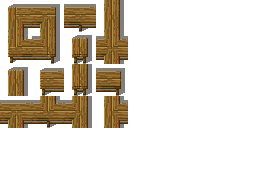
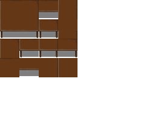

### Autotiles
Autotiles, referred to in game code as "multitiles" as well, are tiles that display differently depending on their relationship to other sprites in the group. Water is a classic example: drawing water as an autotile allows it to display as a single body with edges, instead of either individual little puddles, or a large blue expanse with no shoreline.

This is the template used in the python script that can slice autotiles up into manageable in-game-useage multitiles.


Currently, there are only a few of these tiles supported in CDDA, although some day it would be nice to have all of them available. With the current tile support there are two ways you might use an autotile, demonstrated by the bench and table autotiles. What we're missing is the ability to draw different types of *diagonal* connections. Without that, we have to represent things that are likely to have diagonal connections or unlikely to have them in different ways.




These break down into a few parts as recognized by the game.

**corner**: as you'd expect, these are corners of the connected tiles, attaching to two adjacent tiles that are perpendicular to the tile in question.

**edge**: these are tiles connected either on the top-bottom or left-right sides, arranged in a straight line.

**center**: This is a 4-way intersection tile, connected on all sides.

**t_connection**: These are the 3-way intersection tiles.

**end_piece**: These tiles are connected only on one side.

**unconnected**: This is a tile just hanging out alone.

#### Things like benches

The bench autotile is an example of an autotile that we don't really expect to be displayed double-thick most of the time. Generally you're going to draw a bench like this:
```
.....
bbbbb
.....
```
rather than like this:
```
bb.bb
bb.bb
bb.bb
```

For this reason, the **t_connection** and **center** art for the bench are drawn as 3-way and 4-way intersections.


#### Things like tables

The table autotile is an example of a tile you would often expect to be drawn double-thick, connecting to itself. While you might also draw it one tile wide, two or more tiles of contiguous table are common. For this reason you can't assume there's an edge visible on a **t_connection** or **center** tile. Consider the center tile in a table like this, represented by a capital T amidst lower case:
```
.....
.ttt.
.tTt.
.ttt.
.....
```
That **center** tile can't be drawn as a 4-way intersection, or there would be holes in the table. It has to be drawn as a flat contiguous tabletop. Likewise the **t_intersection** tiles (the middle piece of each edge section) should be assumed to connect diagonally as well, again to prevent holes in the table.
