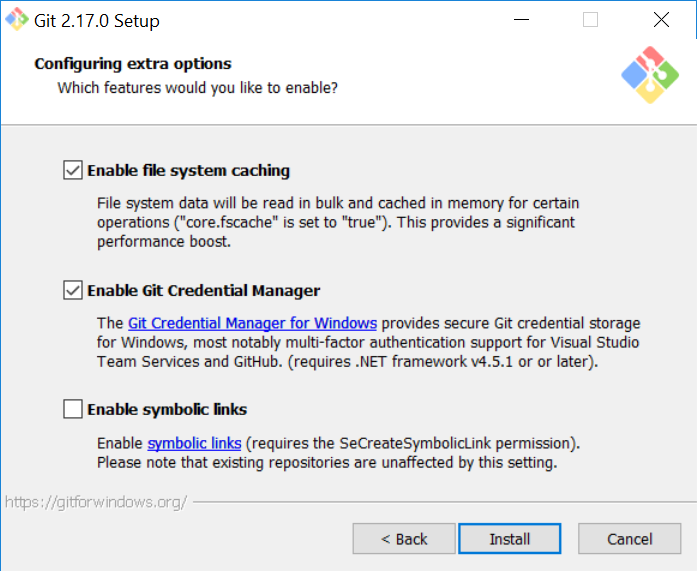

# How to clone Chibi-Ultica's symlinks on Windows

This guide comes from [Stackoverflow](https://stackoverflow.com/questions/5917249/git-symlinks-in-windows/52097145#52097145)

## 1. Make sure git is installed with symlink support ( this might require to re install git )



## 2. Tell Bash to create hardlinks instead of symlinks

- Edit: *(git folder)/etc/bash.bashrc*

- Add to bottom: `MSYS=winsymlinks:nativestrict`

## 3. Set git config to use symlinks

- Run command: `git config core.symlinks true`

OR if you have not cloned the repo yet

- Run command:`git clone -c core.symlinks=true https://github.com/I-am-Erk/CDDA-Tilesets.git`

## 4. Pull the repo

NOTE: Unless you have enabled developer mode in the latest version of Windows 10, you need to **run git bash as administrator** to create symlinks

## 5. Reset all symlinks (optional)

If you had already cloned the repo before the introduciton of the Chibi_Ultica symlinks, you may find that the symlinks are not being created correctly 
so to refresh all the symlinks in the repo you can run these commands.
```
find -type l -delete
git reset --hard
```
NOTE: this will reset any changes since last commit so make sure you have committed first


