# HollowMoon general style guidelines

A bunch of rules that can be applied for every type of sprite.

## Summary

In general you should focus on keeping things simple, eye catching and visually interesting where possible.
When in doubt about something you can contact Joshuu on the discord or [secretstamos](https://github.com/secretstamos) on Github. If you do, please send the original file to make helping you easier.

## Use a limited set of colors as in pseudo-16 bit format

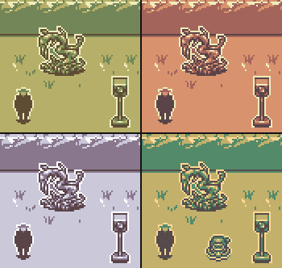

Colors are exclusively limited to four [main colors](#rgb-values) in HollowMoon per season. You only need to submit sprites in the one color scheme - the [script](#script) can handle the other seasons.

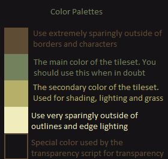

Note: You **must** use these [colors](#rgb-values) in their exacts. The [script](#script) cannot detect any other colors.

## Use hard edges and borders around everything

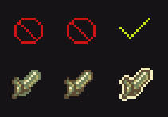

Everything needs a hard edge and a border. The edge should be in a dark color and the border should be in the lightest color.

## Shadows are allowed for items and furniture

You are allowed and encouraged to use shadows outside of borders for world objects and characters.

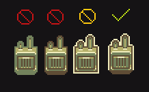

Shadows for items however must maintain the bottom border. See:

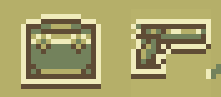

## Light direction, illumination and dark areas

General location of the sun (or light in general) is top left.

Light is coming from the top left side (illuminated areas) towards the bottom right side (darker areas, shadows).

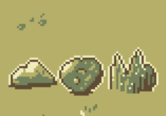

### Illumination of round objects, like orbs

Same goes for round objects. Mind that different surfaces reflect light differently.

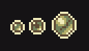

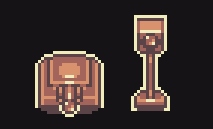

## Keep it light and fluffy

A very important goal of this set - keep things generally thick and fluffy wherever possible. It is important to disregard reality and detail in situations where they might hinder the final product's readability.

A whip, for example, is a very long and thin object. While you might initially think that a whip would be a single pixel wide (as it would be, realistically) this wouldn't be a good idea.

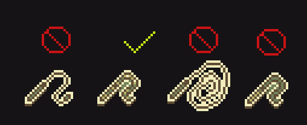

As seen in the above image, while the left whip retains a similar form to the acceptable whip, it is too thin and realistic for the set. It is needed to thicken out.
Likewise, the center right whip might be realistically sized, but this level of detail does nothing to help and only exceeds its welcome.
The far right image is structurally identical to the acceptable whip but it does not pop. Without simple highlights, it blends together and doesn't look very good at all.

Please keep these in mind, especially when doing ropes, chains, plants, fences and other thin objects.

## Revisions happen

Lastly it is important to recognize that revisions are bound to happen. I will periodically perform content revisions from time to time.

## The Scrapbook and how to use it

There are two files that are referenced as 'the Scrapbook' or 'the Sketchbook'

1. [First file](https://github.com/I-am-Erk/CDDA-Tilesets/blob/master/gfx/HollowMoon/scrap/Lots_and_lots_of_sprites_by_secretstamos_to_sort_edited.png) is a PNG file with sorted unimplemented sprites, that can be implemented as is or after some changes according to the style of the tileset.

2. [Second file](https://github.com/I-am-Erk/CDDA-Tilesets/blob/master/gfx/HollowMoon/scrap/Lots_and_lots_of_sprites_by_secretstamos_to_sort.png) is a PNG file with unsorted sprites, both implemented and unimplemented. Use it as a resource to fuel your imagination when you create new sprites, as it can be a valuable insight of the general feel of the tileset. Remember though, that this is still just a sketchbook full of prototypes, unfinished images, and concept art - so not everything there is compliant to the offcial style of the tileset. Do not change this file.

When deciding to make a new sprite, be sure to check the [scrap section](https://github.com/I-am-Erk/CDDA-Tilesets/tree/master/gfx/HollowMoon/scrap) to see if it already exists, and in particular the [First file mentioned above](https://github.com/I-am-Erk/CDDA-Tilesets/blob/master/gfx/HollowMoon/scrap/Lots_and_lots_of_sprites_by_secretstamos_to_sort_edited.png). There are plenty of sprites that are already finished that haven't been implemented yet.
When you decide to implement it, remove the sprite from the file.

Once you're certain it hasn't been already been done, that is a great time to start. Otherwise use the sprite in the scrapbook to implement it in the tileset.

## Detailed guides

- [Overlay](https://github.com/I-am-Erk/CDDA-Tilesets/blob/master/doc/style/HollowMoon/overlay.md)
- [Terrain](https://github.com/I-am-Erk/CDDA-Tilesets/blob/master/doc/style/HollowMoon/terrain.md)
- [Walls](https://github.com/I-am-Erk/CDDA-Tilesets/blob/master/doc/style/HollowMoon/walls.md)

## Script

There is a Python helper script named: **recolor_season_variants.py**

Creating seasonal variants of your tiles manualy is inconvenient.
This is where Python script comes in to handle this job for you.
It creates recolored seasonal variations for sprites in target folder or even all subfolders for HollowMoon tileset.
It requires a PNG file made in one of the seasonal palettes.

**Usage**:

1. Create a PNG sprite in any consistent palette allowed by HollowMoon tileset.
For transparency use background color allowed by the tileset, it will be replaced
by the script with true transparency.

2. Create a subfolder and name it using target file's name (for example 't_dirt').
Name should correspond to how the game names relevant object (terrain, furniture, etc.).

3. Name your source PNG file {season}.png (for example summer.png) where {season}
corresponds to the palette you used to create the sprite.
If you used a spring palette you can also call it 'generic.png'.

4. Place the file in the created subfolder and run the script targeting that folder.
Script will also target subfolders so you can run it for the whole tileset folder.

## RGB values

Here are exact **RGB values of colors** used in each and every palette:

- **Spring RGB**: (240, 236, 187), (181, 175, 105), (115, 130, 92), (95, 76, 53),
- **Summer RGB**: (255, 216, 148), (194, 176, 107), (83, 138, 106), (73, 75, 88),
- **Autumn RGB**: (230, 227, 171), (216, 147, 110), (163, 100, 92), (90, 68, 72),
- **Winter RGB**: (254, 254, 254), (203, 200, 218), (137, 119, 142), (90, 68, 72)

- **Background** (for the script transparency): 21, 19, 21 (equal to HTML 151315)
    Background is translated to true transparency of: (255, 255, 255, 0) by the script.

## FAQ

**Q:** There are some "shadow" sprites consisting of only outlined dark body. Are they allowed or are they placeholders? 
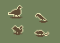 
**A:** The "shadow" sprites are to be used for small monsters that don't need detail or would look bad with detail.
In other cases (like items) they are to be enlarged enough to utilize the palette - remember: readability first.
"Shadow" sprites can be **sparingly** used as placeholders.

## Thanks for reading! Good luck out there

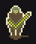
