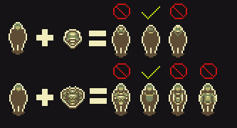
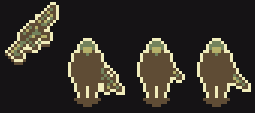

# Overlay

Item overlays should focus simplicity over all else. We generally want the characters to remain undetailed and anonymous. 

When in doubt, keep it simple. Do not use the lightest color anywhere inside a character or on an item overlay

# Weapon overlays

Weapon overlays should follow a similar rule to armor overlays with simplicity. They should be held in one hand such as the following examples:

