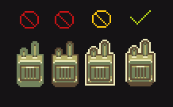
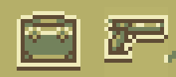
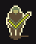

# General style guidelines

A bunch of rules that can be applied for every type of sprite.

## Summary

In general you should focus on keeping things simple, eye catching and visually interesting where possible.
When in doubt about something you can contact Joshuu on the discord or [secretstamos](https://github.com/secretstamos) on Github. If you do, please send the original file to make helping you easier. 

## Use a limited set of colors as in pseudo-16 bit format

Colors are exclusively limited to four main colors in HollowMoon per season. You only need to submit sprites in the Spring color scheme- the script can handle the other seasons.

Note: You *must* use these colors in their exacts. The script cannot detect any other colors.

## Use hard edges and borders around everything

Everything needs a hard edge and a border. The edge should be in a dark color and the border should be in the lightest color. 

## Shadows are allowed for items and furniture

You are allowed and encouraged to use shadows outside of borders for world objects and characters.

Shadows for items however must maintain the bottom border. See:

## Keep it light and fluffy

A very important goal of this set- keep things generally thick and fluffy wherever possible. It is important to disregard reality and detail in situations where they might hinder the final product's readability.

A whip, for example, is a very long and thin object. While you might initially think that a whip would be a single pixel wide (as it would be, realistically) this wouldn't be a good idea. 

As seen in the above image, while the left whip retains a similar form to the acceptable whip, it is too thin and realistic for the set. It is needed to thicken out.
Likewise, the center right whip might be realistically sized, but this level of detail does nothing to help and only exceeds its welcome. 
The far right image is structurally identical to the acceptable whip but it does not pop. Without simple highlights, it blends together and doesn't look very good at all. 

Please keep these in mind, especially when doing ropes, chains, plants, fences and other thin objects. 

## Revisions happen
Lastly it is important to recognize that revisions are bound to happen. I will periodically perform content revisions from time to time. 

## Check the document first
When deciding to make a new sprite, be sure to check the [scrap](https://github.com/I-am-Erk/CDDA-Tilesets/tree/master/gfx/HollowMoon/scrap) section to see if it already exists, and in particular this [file](https://github.com/I-am-Erk/CDDA-Tilesets/blob/master/gfx/HollowMoon/scrap/Lots_and_lots_of_sprites_by_secretstamos_to_sort_edited.png) . There are plenty of sprites that are already finished that haven't been implemented yet. 
Once you're certain it hasn't been already been done, that is a great time to start. 

## Extra informations

- [Overlay](https://github.com/Fris0uman/CDDA-Tilesets/blob/organisation_fix/doc/style/HollowMoon/overlay.md)
- [Terrain](https://github.com/Fris0uman/CDDA-Tilesets/blob/organisation_fix/doc/style/HollowMoon/terrain.md)
- [Walls](https://github.com/Fris0uman/CDDA-Tilesets/blob/organisation_fix/doc/style/HollowMoon/walls.md)

## Thanks for reading! Good luck out there

