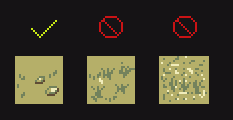
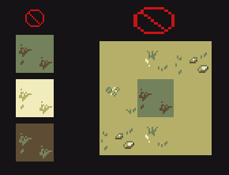

# Terrain
## Terrain

## Composition
One of the main things to be careful about with composition is to avoid excess noise. Heavy use of dark colors or light colors can cause issues. 

In general terrain, like the player sprite, should be more subdued and less shaded when compared to items or furniture. 

## Tiling
To ensure your tiles mesh well with other tiles, the secondary color should be used as a base. Using other colors as a base can lead to issues of fitting in and make borders obvious.

As seen above, this tile sticks out. 
