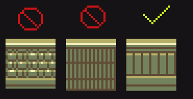
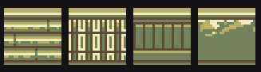

# Terrain

## Composition
Like terrain, it is important to keep walls simple. Since they are more angled, they are allowed additional shading, however noise should be reduced whereever possible. 

## Bumpers
As you might have noticed, walls have a uniform bumper at the top. Please keep this in mind when adding new walls or coverting walls that might not have this. 
This should also help speed up future wall creation.

