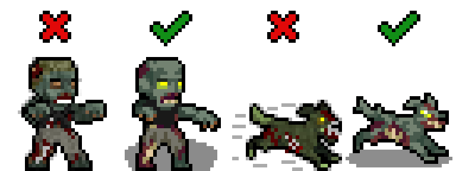
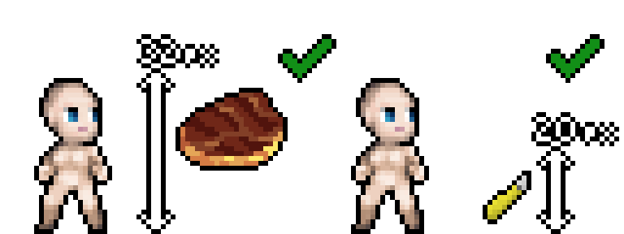

# MShockXotto+ style guide

MShockXotto+ was originally the mashup of the MShock and the Xotto tileset, both of which were already build on a few other tilesets. This means that MSX never had a strong style guide.
And it still has not, the present style guide will list a few rules to follow but since MSX is a patchwork of different styles there's a lot of wriggle around the guide.
The main thing that we want to keep from the previous tilesets is the anime/cartoon style of the monsters and characters, and the main thing we're moving away from is the random noise over sprites.

- Cartoon style, make your sprite recognisable.
- Clean texture without random noise
- Keep the colour count per material (bone, meat, cotton, wood, metal etc...) low, around 3-4 per material.

## Monsters

- Black outline RGBA(0,0,0,255)
- Round shadow directly below the monster RGBA(0,0,0,115)

### Optional but Helpful

While not strictly necessary, these tools and knowledge will help:

- A visual editing program ([**Aseprite**](https://github.com/aseprite/aseprite) is a good option)
- Basic pixel art fundamentals such as **Jaggies**, **Hue Shifting**, **Anti-Aliasing**, **Banding**, etc. If you need to learn these, check out these [guides](https://pixeljoint.com/forum/forum_posts.asp?TID=11299&PID=139318#139318) and [tutorials](https://makegames.tumblr.com/post/42648699708/pixel-art-tutorial).

### Finding References

References are essential when creating any sprite. Start by gathering visual references for what you want to create.

Not all creatures in Cataclysm have real-world counterparts. You can create your own references through **photobashing** (combining multiple images) or drawing your own. Photobashed references don't need to be perfect—they just serve as a visual guide.

Your own hand-drawn references work great too. You can shrink your drawings into pixel art size and use them as tracing tools.

> [!WARNING]
> Avoid AI for reference materials. While AI results may look polished, they often introduce errors in anatomy and shading that will affect your sprite quality.

### Sprite Size

The most common sprite size is **32x32**, which works fine for anything human-sized or smaller. For larger creatures (megafauna, bosses, etc.), consider using **64x64** or larger sizes. A bigger sprite better conveys size and threat while providing more room for detail.

### Creating the Outline

1. Start with a clear outline in **pure black RGBA(0,0,0,255)**
2. Only the outward-facing outline strictly needs to be black, but outline everything for now
3. Refine by removing jaggies as needed
4. Later, recolor any internal black lines if needed

### Picking Colors

Use existing color palettes from established MSX+ sprites when possible. Study sprites by Dandy in particular for good examples.

If you create your own palette, keep it to **2–5 colors** and use **[Hue Shifting](https://www.blue-canary.net/miniature-painting/painting-tips-and-guides/hue-shifting/)**: start with cool dark colors and gradually shift toward warm tones. You can also mix multiple color ramps from existing palettes.

[Lospec](https://lospec.com/palette-list) has community palettes available for download and use.

Start with the darkest (non-black) color in your palette and build up. Since you're working with limited colors in a cartoony style, dark colors serve double duty for both shading and base color (like fur).

### Shading

Build up color gradually from dark to light. The characteristic MSX+ style uses **rectangular blocks of color** for shading:

Sparingly use the lightest colors from your palette.

Use a little anti-aliasing on larger sprites (64x64+), but keep it minimal to maintain the clean, cartoon aesthetic.

### Polish

Take breaks and view your work with fresh eyes. Ask for feedback if you hit a wall. Small adjustments—brightness, inner line colors, alternative shading—often make the difference between good and great.

### Shadows

Add shadows **after** the sprite is complete:

- Use pure black with transparency set to 115 : **RGBA(0,0,0,115)**
- Shape as a **circle directly below the monster**
- For large sprites, use tools like the filled ellipse tool in Aseprite

> [!Tip]
> You can use one of those shadows:      

## Items

- Black outline RGBA(0,0,0,255)
- Items should be roughly scaled to the character, meaning that small object like pens and box cutter should be 20x20 and big items like disconnected oven should be 32x32.
- However, magnified items, like this 32x32 cooked meat sprite, are still okay for the sake of being easy to recognise and looking nice.

### Grades of Steel

  

  Use those palettes to differentiate the various grade of steel in items

## Furnitures

- Outline using a less-saturated, darker color taken from the sprite's palette.

## Terrain

- No outline required
- Terrain should fill their canvas as the game doesn't display anything behind them. Transparency will appear black in game.
