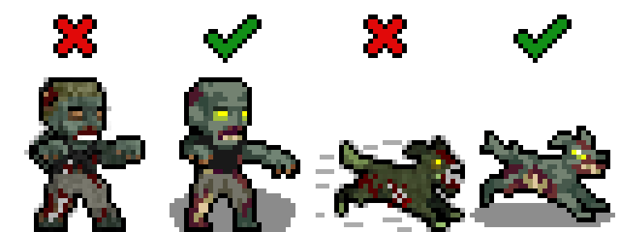
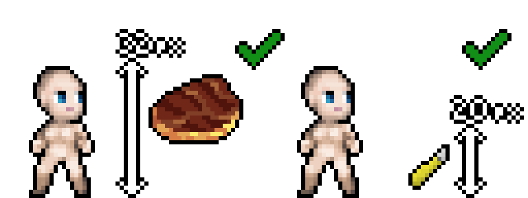
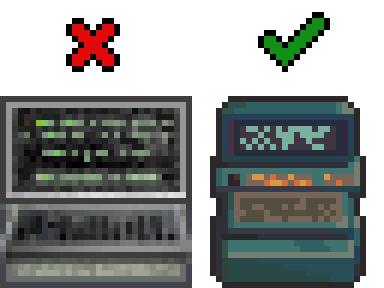
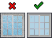

# General

MShockXotto+ was originally the mashup of the MShock and the Xotto tileset, both of which were already build on a few other tilesets. This means that MSX never had a strong style guide.
And it still has not, the present style guide will list a few rules to follow but since MSX is a patchwork of different styles there's a lot of wriggle around the guide.
The main thing that we want to keep from the previous tilesets is the anime/cartoon style of the monsters and characters, and the main thing we're moving away from is the random noise over sprites.

- Cartoon style, make your sprite recognisable.
- Clean texture without random noise
- Keep the colour count per material (bone, meat, cotton, wood, metal etc...) low, around 3-4 per material.

# Monsters

- Black outline RGBA(0,0,0,255)
- Round shadow directly below the monster RGBA(0,0,0,115)

# Items

- Black outline RGBA(0,0,0,255)
- Items should be roughly scaled to the character, meaning that small object like pens and box cutter should be 20x20 and big items like disconnected oven should be 32x32.
- However, magnified items, like this 32x32 cooked meat sprite, are still okay for the sake of being easy to recognise and looking nice.

# Furnitures

- Outline using a less-saturated, darker color taken from the sprite's palette.

# Terrain

- No outline required
- Terrain should fill their canvas as the game doesn't display anything behind them. Transparency will appear black in game.
