# Used Colors and Pens properties

## At the beginning there was SM_Overmap

The idea for this tileset had been floating around for quite some time, and I wasn’t the first to implement it. A survivor character drawing their own map is a fairly obvious move. The first to implement it was @curstwist with the SurveyorMap tileset. I am very glad that I was able to participate in its creation. However, there we drew player markings on top of the ‘official’ map. I made some decisions there that later turned out to be not the most popular among players.

For example, the background. Many find it very bright in the SM tileset. And Wist is going to make it darker. In search of inspiration, I looked at old hand-drawn maps. And I decided that the new tileset should be just like that.

   
SM background circa 2022

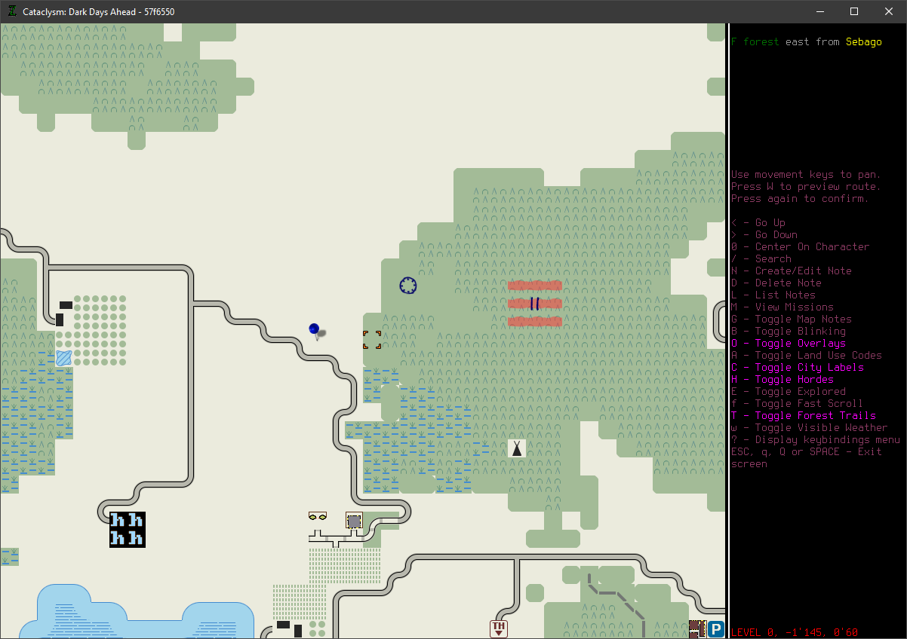

   
Old map, example 1

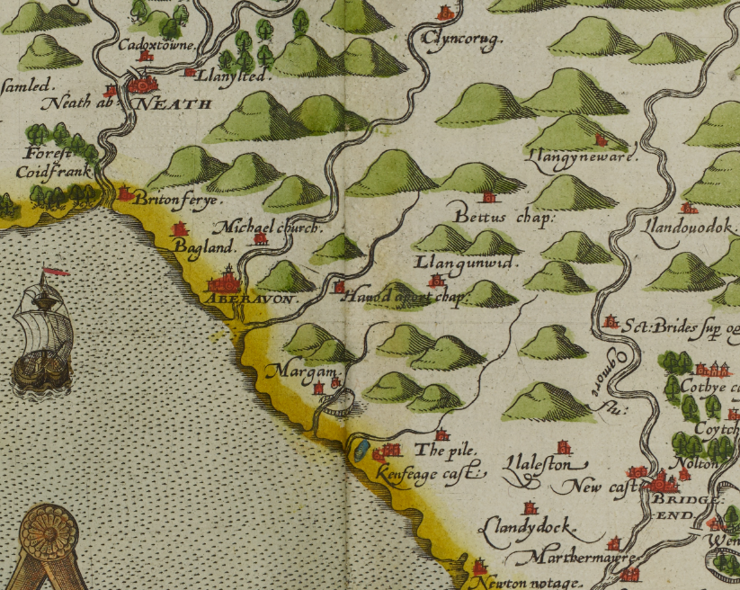

   
Old map, example 2

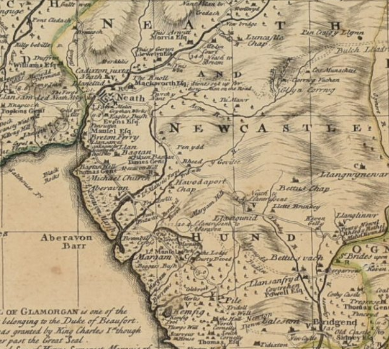

The background color should resemble paper in dim light, paper in the light of a flashlight. And the brightness of the map should not be more than 50%. Since most of the time players see unexplored territory (black) and often move at night (the main screen is dark). At the same time, Ultica in winter is quite bright.

Below you can see first attempt to find a sweet spot (top left) and current background (bottom right).
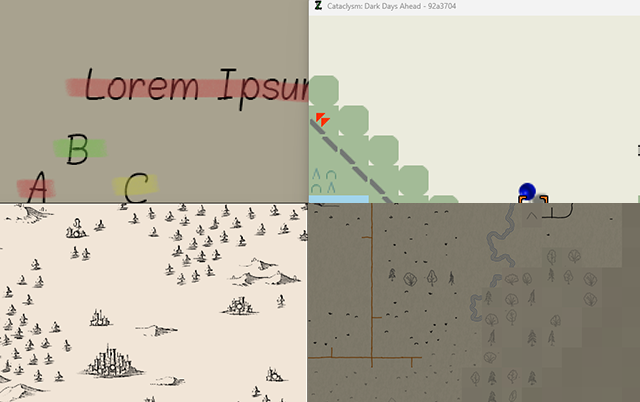

Looking at the image above, the map’s background might seem dark. However, below I provide a comparison of the map with nighttime player movements (bottom left quarter) and a bright spring day (bottom right quarter). As you can easily see, the map is not much darker than the daytime screenshot, and I hope it doesn’t differ significantly from the nighttime one.

In any case, the entire tileset is based on the concept of transparent sprites. This will allow any adjustments to the background if necessary.

## Background

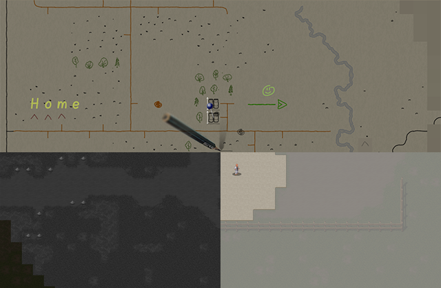

1) As I just mentioned, sprite transparency is one of the pillars of the tileset.

2) The second pillar is having multiple variations for the same object.

3) Third is hand-drawn elements (wobbly lines, absence of straight angles, etc.).

4) And the last - readability takes precedence over artistic beauty. The image should be clear at first glance, without forcing the player to decipher a jumble of lines. You can imagine it as the survivor trying to mark an object on the map as quickly as possible, rather than creating a museum-worthy piece of art.

And the background is no exception from these rules. To create the feeling of a large sheet of paper on which the map is drawn, I created 25 sprite variations (you can see the workflow in the corresponding section).

Background color: #7d7869 or in the HSB model:

- Hue: 45
- Saturation: 15%
- Brightness: 50%

*Due to the additional texture imitating irregularities, the saturation and brightness values may vary slightly in different areas.*

Below, I provide the original sprite, which was later divided into 25 variations.

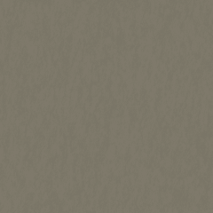

Regarding the fog of war, I initially wanted to make these areas lighter, as if the paper there was cleaner, and the known area of the map was where the player had already drawn/erased objects. However, I later abandoned this idea in favor of the more commonly accepted darkening.

Another idea is to make the unknown territory noisy, so it appears out of focus or with interference. This can be achieved using the same variations, by playing with the saturation and brightness of the sprites.

Even a fluctuation of minus two percent to plus two percent is noticeable on a large map, but completely invisible on the original large sprite.

| background for uncertain areas | background for unknown areas |
|--------------------------------|------------------------------|
| 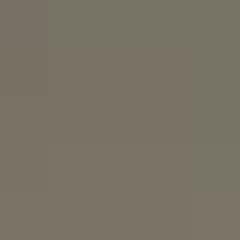 | 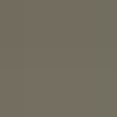 |

In game you can notice those effects easily:
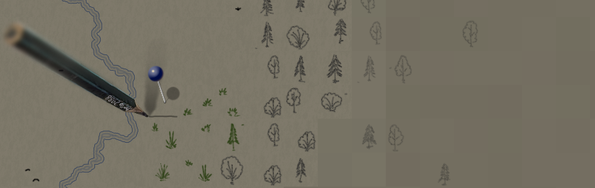

## Drawing lines

I wanted to move away from the pixel art style in map representation while staying within the existing sprite rendering methods.

To achieve this, I decided to use the “brush” tool instead of the “pencil”. This creates of semi-transparent pixels when drawing, and from a sufficient distance, it gives the effect of smooth lines drawn with a pen on paper.

Since the map in the game can be scaled, I had to use a width of 2 pixels to maintain the visibility of the lines.

However, with this tool, the usual 24 or 32 pixels per tile become too small a canvas for drawing.

Thus, the resulting sprite size became 48x48 pixels.

Note that coloring even a small part of the image (e.g., the entrance to a cave) immediately makes the object stand out on the map. Try not to overuse this.

| Pencil | Pen |
|--------|-----|
| 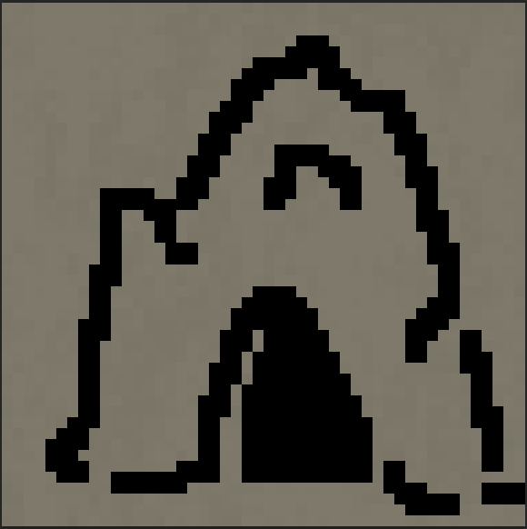 | 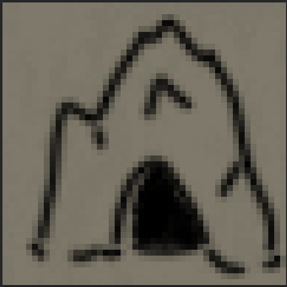 |

> [!WARNING]
> The background here is just for better visibility. The actual sprite has a transparent background.

Most objects should be drawn with a black pen, as they have better contrast with the background.

Common houses are brown (refer to colors [here](./fallback.md)), forest trees are green, and meadows are brown, as well as dirt roads.

Military objects and craters are red.

Water bodies (from streams to oceans) have a different blue color than those described above. The main color is RGB: #001c54, HSB: 220 / 100% / 33%.

The pencil is a black "pen" with 50% transparency. Large overmap objects (starting from 2x2 tiles) should have a pencil border line.

Objects on the map should be drawn with dark pens or pencils. White is reserved for extremely important marks like high objects and "stairs" between Z-levels.

*Also used for highlighting autotravels and recently revealed roads so it is pretty common sometimes.*

Bright "highlighters" are for manual player usage.

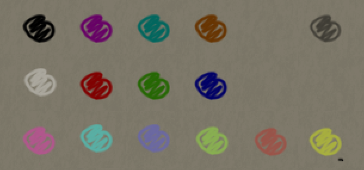
