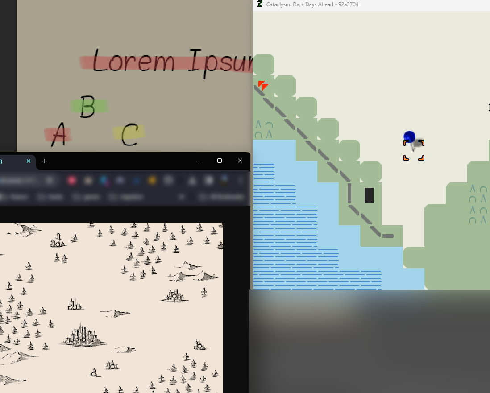
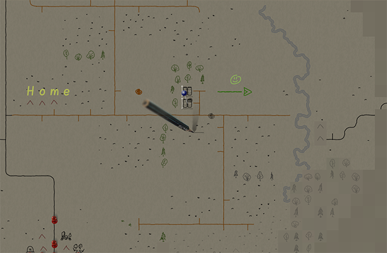

# Used Colors and Pens properties

The idea for this tileset had been floating around for quite some time, and I wasn’t the first to implement it. A survivor character drawing their own map is a fairly obvious move. The first to implement it was @curstwist with the SurveyorMap tileset. I am very glad that I was able to participate in its creation. However, there we drew player markings on top of the ‘official’ map. I made some decisions there that later turned out to be not the most popular among players.

For example, the background. Many find it very bright in the SM tileset. And Wist is going to make it darker. In search of inspiration, I looked at old hand-drawn maps. And I decided that the new tileset should be just like that.

   
SM background circa 2022

   
old map, example 1

   
old map, example 2

The background color should resemble paper in dim light, paper in the light of a flashlight. And the brightness of the map should not be more than 50%. Since most of the time players see unexplored territory (black) and often move at night (the main screen is dark). At the same time, Ultica in winter is quite bright.

Below you can see first attempt to find a sweet spot and current background.

