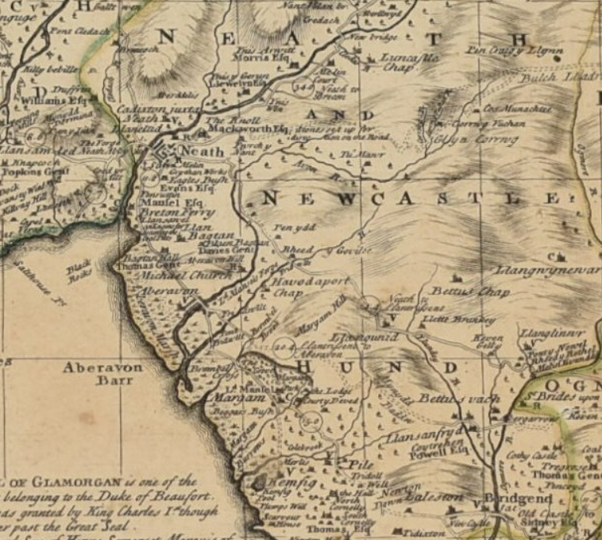
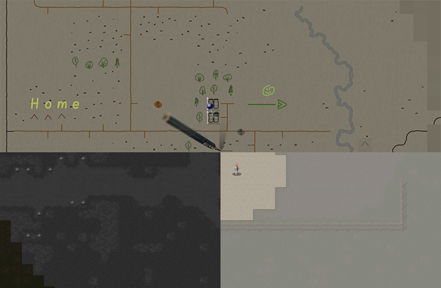
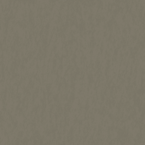
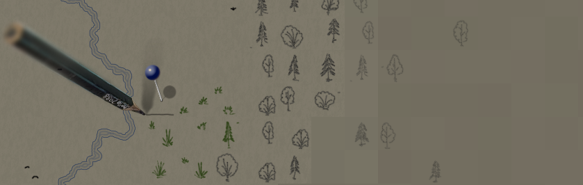
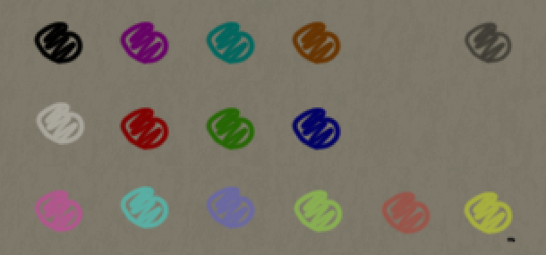

# Використані властивості кольорів та ручок

## Спочатку був SM_Overmap

Ідея цього тайлсету існувала вже деякий час, і я не був першим, хто її реалізував. Малювання власної карти вижившим персонажем є досить очевидним кроком. Першим, хто реалізував це, був @curstwist з тайлсетом SurveyorMap. Я дуже радий, що зміг взяти участь у його створенні. Однак там ми малювали позначки гравця поверх «офіційної» карти. Я прийняв деякі рішення, які пізніше виявилися не найпопулярнішими серед гравців.

Наприклад, фон. Багато хто вважає його дуже яскравим у тайлсеті SM. І Віст збирається зробити його темнішим. У пошуках натхнення я переглядав старі карти, намальовані вручну. І вирішив, що новий тайлсет повинен бути саме таким.

   
Фон SM приблизно 2022 року

   
Стара карта, приклад 1

   
Стара карта, приклад 2

Колір фону повинен нагадувати папір у тьмяному світлі, папір у світлі ліхтарика. І яскравість карти не повинна перевищувати 50%. Оскільки більшість часу гравці бачать невідкриту територію (чорну) і часто пересуваються вночі (основний екран темний). Водночас, Ultica взимку досить яскрава.

Нижче ви можете побачити першу спробу знайти оптимальний варіант (верхній лівий кут) і поточний фон (нижній правий кут).

Дивлячись на зображення вище, фон карти може здатися темним. Однак нижче я надаю порівняння карти з нічними переміщеннями гравця (нижній лівий квартал) і яскравим весняним днем (нижній правий квартал). Як ви легко можете побачити, карта не набагато темніша за денний скріншот, і я сподіваюся, що вона не сильно відрізняється від нічного.

У будь-якому випадку, весь тайлсет базується на концепції прозорих спрайтів. Це дозволить за необхідності внести будь-які корективи у фон.

## Фон

1) Як я вже згадував, прозорість спрайтів є одним з основних принципів тайлсету.

2) Другий принцип - наявність кількох варіацій для одного й того ж об'єкта.

3) Третій - елементи, намальовані вручну (нерівні лінії, відсутність прямих кутів тощо).

4) І останній - читабельність має перевагу над художньою красою. Зображення повинно бути зрозумілим з першого погляду, не змушуючи гравця розшифровувати плутанину ліній. Ви можете уявити, що виживший намагається швидко позначити об'єкт на карті, а не створювати музейний шедевр.

І фон не є винятком з цих правил. Щоб створити відчуття великого аркуша паперу, на якому намальована карта, я створив 25 варіацій спрайтів (ви можете побачити процес у відповідному розділі).

Колір фону: #7d7869 або в моделі HSB:

- Відтінок: 45
- Насиченість: 15%
- Яскравість: 50%

*Через додаткову текстуру, що імітує нерівності, значення насиченості та яскравості можуть трохи відрізнятися в різних областях.*

Нижче я надаю оригінальний спрайт, який пізніше був розділений на 25 варіацій.

Щодо туману війни, я спочатку хотів зробити ці області світлішими, ніби папір там чистіший, а відома область карти - це та, де гравець вже намалював/стер об'єкти. Однак пізніше я відмовився від цієї ідеї на користь більш загальноприйнятого затемнення.

Ще одна ідея - зробити невідому територію шумною, щоб вона виглядала розфокусованою або з перешкодами. Це можна досягти за допомогою тих самих варіацій, граючи з насиченістю та яскравістю спрайтів.

Навіть коливання від мінус двох відсотків до плюс двох відсотків помітні на великій карті, але зовсім непомітні на оригінальному великому спрайті.

| фон для невизначених областей | фон для невідомих областей |
|--------------------------------|------------------------------|
|  |  |

У грі ви легко помітите ці ефекти:

## Малювання ліній

Я хотів відійти від стилю піксельної графіки в представленні карти, залишаючись в межах існуючих методів рендерингу спрайтів.

Щоб досягти цього, я вирішив використовувати інструмент «пензель» замість «олівця». Це створює напівпрозорі пікселі під час малювання, і з достатньої відстані це дає ефект гладких ліній, намальованих ручкою на папері.

Оскільки карту в грі можна масштабувати, я повинен був використовувати ширину 2 пікселі, щоб зберегти видимість ліній.

Однак з цим інструментом звичайні 24 або 32 пікселі на тайл стають занадто малим полотном для малювання.

Таким чином, розмір отриманого спрайту став 48x48 пікселів.

Зверніть увагу, що зафарбовування навіть невеликої частини зображення (наприклад, входу в печеру) відразу робить об'єкт помітним на карті. Намагайтеся не зловживати цим.

| Олівець | Ручка |
|---------|------|
|  |   |

> [!WARNING]
> Фон тут лише для кращої видимості. Реальний спрайт має прозорий фон.

Більшість об'єктів слід малювати чорною ручкою, оскільки вони мають кращий контраст з фоном.

Звичайні будинки коричневі (див. кольори тут), лісові дерева зелені, а луки коричневі, як і ґрунтові дороги.

Військові об'єкти та кратери червоні.

Водні об'єкти (від струмків до океанів) мають інший синій колір, ніж ті, що описані вище. Основний колір - RGB: #001c54, HSB: 220 / 100% / 33%.

Олівець - це чорна "ручка" з 50% прозорістю. Великі об'єкти на карті (починаючи з 2x2 тайлів) повинні мати олівцеву обводку.

Об'єкти на карті слід малювати темними ручками або олівцями. Білий колір зарезервований для надзвичайно важливих позначок, таких як високі об'єкти та "сходи" між рівнями Z.

*Також використовується для виділення автоподорожей і нещодавно виявлених доріг, тому іноді це досить поширено.*

Яскраві "маркери" призначені для ручного використання гравцем.

