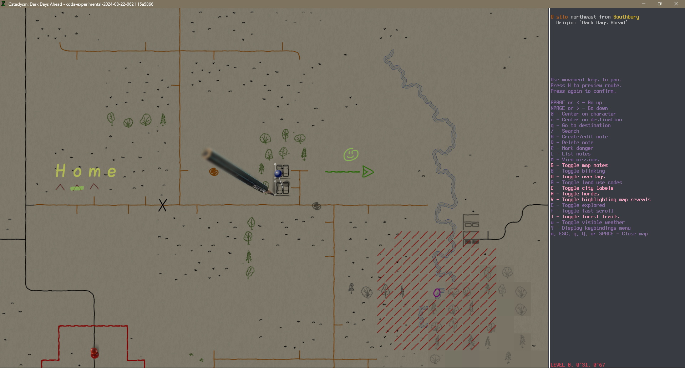

# Як використовувати цей набір плиток

Щоб отримати максимальну користь від цього набору плиток, важливо розуміти, що він вимагає більшої взаємодії гравця.

За замовчуванням колірні позначення на карті мінімальні, і це зроблено навмисно. Це дозволяє гравцеві самостійно позначати цікаві місця та зони небезпеки на карті. Так само, як ми робимо нотатки на реальній карті, гравець повинен додавати деяку інформацію вручну.

Звичайно, у грі є функція Autonotes, і я намагався зробити так, щоб ці нотатки відповідали стилю того, що гравець може додати вручну. Таким чином, ручні нотатки та Autonotes повинні доповнювати один одного.

Давайте розглянемо ближче:

Як ви бачите, тут є кілька нотаток:

1) Жовта "Home" над трьома будівлями. Ця нотатка складається з чотирьох різних нотаток. Це звичайні нотатки, які гравець може написати за допомогою клавіші `N`.
(`H:`,`o:`,`m:` та `e:` - значення нотаток. Як ви бачите, тільки `:` використовується для визначення гліфа карти, а колір за замовчуванням жовтий.)
2) Під `Home` є зелений штрих. Його можна досягти за допомогою нотатки `-:g;`. Штрихи маркерів (яскраві кольори) відносно широкі.
3) Чорна позначка `X` на дорозі зроблена вручну.
4) Але коричневе коло біля олівця - це autonote (*мертві овочі*).
5) Сіре коло на дорозі (*спалена земля*) також є autonote. Тож ви можете бачити, що ручні нотатки та autonotes досить схожі.
6) Світло-зелене обличчя - це `):g;`. Як ви помітили, ви повинні ставити один символ за раз на карту.
7) Але є інший тип нотаток, які розповсюджуються навколо центральної точки. Це червоні діагональні штрихи навколо пурпурного `o`. Це вказує на зону небезпеки. Було б чудово, якби ми могли створювати інші довгі нотатки, як ця.
8) Червона лінія навколо червоної кнопки - це набір нотаток, які ви можете ~~болісно~~ намалювати за допомогою чисел та символів `+` / `-`.

Повний набір символів можна знайти [тут](./fallback.ua-UA.md#додаткові-функції-резервного-файлу).

## Додаткова інформація

Ви можете змінити кілька аспектів цього набору плиток Overmap на стороні клієнта (але, звичайно, вам доведеться робити це кожного разу після оновлення набору плиток).

- курсор (за замовчуванням олівець)
- яскравість/насиченість фону також

Ви можете завантажити кілька курсорів звідси:

- [Помаранчевий напівпрозорий транспортир](./images/cursor_protractor.png) - Це був перший курсор. Він має кілька приємних особливостей: лінійка на транспортирі відносно точна і майже дорівнює реальним сантиметрам/дюймам, і він має кілька "ручних позначок" для 100 і 200 метрів/ярдів(?). Але цей може бути заплутаним.
- [Класичне маленьке червоне коло](./images/cursor_circle.png) - Може використовуватися, якщо ви віддаєте перевагу курсору, який не охоплює кілька плиток.

> [!WARNING]
> Ви повинні зберегти його як `cursor.png` у `\gfx\PenAndPaper\`. Збережіть оригінальний `cursor.png` десь на всякий випадок.

Щоб змінити яскравість/насиченість набору плиток, використовуйте будь-який редактор зображень і налаштуйте ці файли.
