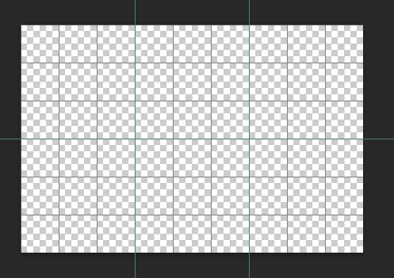
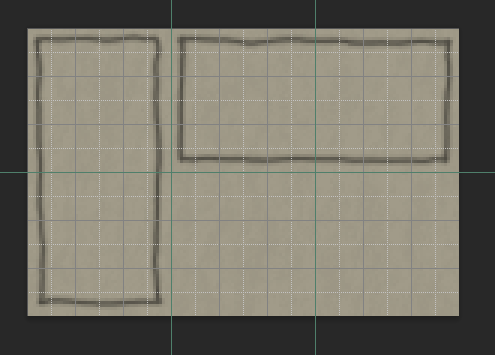
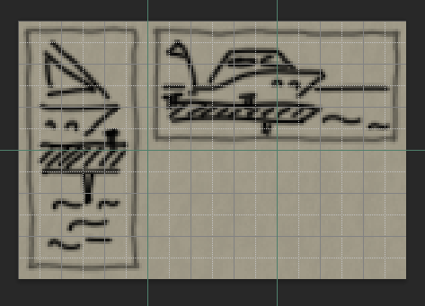
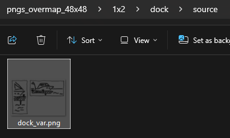
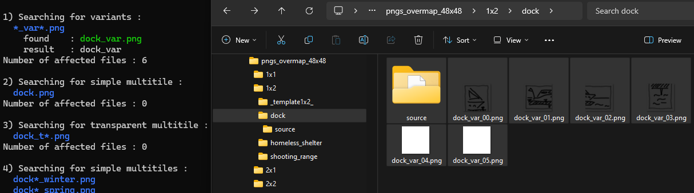

# Workflow example that will help with typical tasks

## Before the start

Create two shortcuts on your desktop for the following scripts:
1) `/CDDA-Tilesets/tools/uptset.cmd`
2) `/CDDA-Tilesets/tools/slicemt.py`

First shortcut will allow you to compose tileset (you need [some sutup](../../installation.md#building) first), and second one allow [quick slice](../../tools/windows_wrappers.md#slicer) big pictures.

## Preparig files

Determine which object on the map requires a sprite. The following set of commands will help: `debug menu` -> `teleport` -> `long range`. Pay attention to the sidebar, where the tile ID will be indicated.

Determine the size of the object. Create the following structure in the corresponding folder:

(for example, for an object named `dock` with a size of 1x2 when faced North)
```
gfx
 |-PenAndPaper
 | |-pngs_overmap_48x48
 | | |-1x2
 | | | |-dock           <-- should be real object name
 | | | | |-source       <-- folder for the big picture
 ...
```

## Drawing

Create a canvas in your favorite editor with dimensions 144x96 pixels (144 = 48 * 3, 96 = 48 * 2).



Create two layers:

1. **Border**: Set this layer to 50% transparency.
2. **Picture**: Set this layer to 0% transparency.

> [!HINT]
> You may add a third layer - Background, and add a tileset background from the game or a solid color.

> [!WARNING]
> Do not forget to TURN OFF the background layer before saving the image!
> All sprites should have a transparent background at this step.

Select the `brush` tool:

- 2px wide
- Black color

Draw two rectangles on the `Border` layer. It should look like this (I like to draw with the background enabled):



Now draw two pictures related to your object (a dock in our case). These pictures should clearly represent the object at a glance. Here, I use a boat, a dock, and a few waves.



Save it as a PNG file named `dock_var.png` into the `source` folder WITHOUT the background.

The real name should follow the rule: `object name` + `_var`.



## Slicing

Now just drag and drop the `source` folder over the `slicemt.py` shortcut you've created before. As a result, you'll get a set of files:



As you can see, slices `dock_var_04.png` and `dock_var_05.png` are empty, and you should delete them as they are unnecessary.

You can also notice that there is a new empty file in the `source` folder named `.scratch`. This file notifies Git that this folder should not be added to the repository.

## Adding JSON

Take a closer look at the game sidebar - you can notice that the `dock` has two tiles:

1. `lake_dock_small` (northmost when the `dock` faces North)
2. `lake_shore_dock_small` (southmost when the `dock` faces North)

Take the corresponding template JSON file and adjust it accordingly:
(using `search and replace` from `template1x2` to `dock_var`)


```json
[
  {
    "id": [
      "lake_shore_dock_small"
    ],
    "rotates": true,
    "fg": [
      "dock_var_03", "dock_var_02", "dock_var_00", "dock_var_01"
    ],
    "bg": [
      { "weight": 1, "sprite": "bg_00" },
...
      { "weight": 1, "sprite": "bg_24" }
    ]
  },


  {
    "id": [
      "lake_dock_small"
    ],
    "rotates": true,
    "fg": [
      "dock_var_00", "dock_var_01", "dock_var_03", "dock_var_02"
    ],
    "bg": [
      { "weight": 1, "sprite": "bg_00" },
...
      { "weight": 1, "sprite": "bg_24" }
    ]
  }
]
```

Save it as `dock.json` and double click on `updtset.cmd` shortcut.
Now you can switch to the game and refresh tileset.
