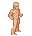

# Creatures

## Take appropriate tile size

Consider 32x64 a default template for human-sized creatures:

# Monster sprites should have ~8px offset from the ground

// TODO: add monster image with measured offset

To give them a 3d look.

# Facing to the right by default

And remember that tiles are mirrored when creatures move.

# Monsters should drop shadows when possible

// TODO: add monster with a shadow image

Put shadows in a `bg` field in json, use `shadow_<width>x<height>_<size>` template. You can find shadow files in the root of any size directory (e.g. `pngs_normal_32x32`).
