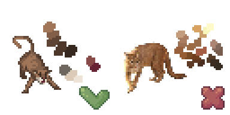
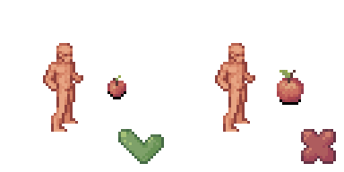
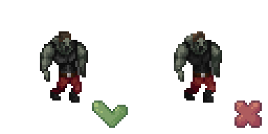
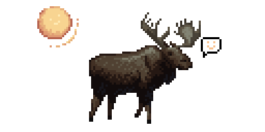

# General style guidelines

A bunch of rules that can be applied for every type of sprite.

## Use a limited set of colors as in pseudo-16 bit format

This is rule is one of the main rules not only for this tileset, but pixel art in general.
Each "colour block" should use 3-6 colors for shades. For example a blue shirt might have one light blue highlight, two medium blue main colours, one dark blue shade, and one very dark blue-green shade.
See [colors tutorials section](https://lospec.com/pixel-art-tutorials/tags/colors) on lospec if you're having troubles with palette.

## Try to draw with realistic proportions

Small items/creatures should be small. But if feel that they are **too small**, it is ok to make them bigger for sakes of ability to be recognized. Be careful about sizes.

## Use hard edges on foreground objects

.. such as items and monsters. This is important because it makes things much more recognizable when zoomed out.

## The default light source is assumed to come from above and to the left.

