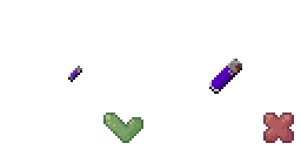
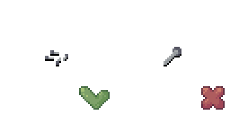
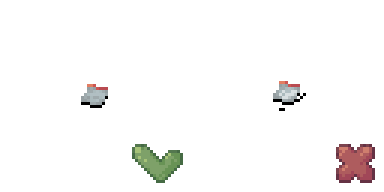
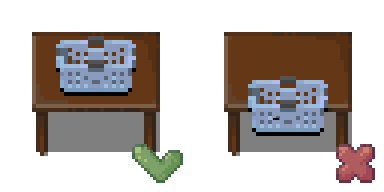

# Items

## Maximum item size is 32x32; small items should fit within 16x16

This is continuation of the general rule.

## Item tiles should be as close to scale as they can be while still recognizable

When in doubt, err on the side of larger, but avoid filling an entire 32x32 tile with a single nail or it would look like a nail as large as a survivor.
Even for single items, putting multiple items into the icon could give it more recognizability without making it look comically huge.

## Containers should be drawn empty

Like jars or bottles. The game will use the same tile no matter the actual content of the item.

## 100% black underline without shadow

// TODO: add item shadow image

No shadow will make sure that players don't confuse several big items with furniture. Black underline helps to identify an item in the game world.

## Consider placement on tables

Table surfaces usually occupy top 19 pixels of a 32x32 sprite, try fitting your items there when possible.
