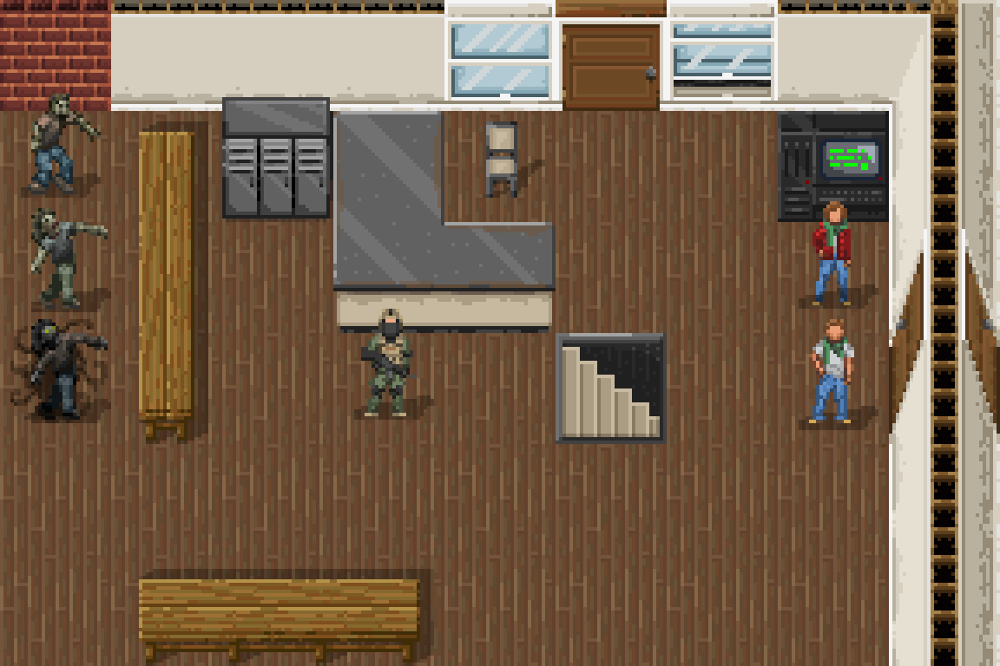

Ultimate Cataclysm (UltiCa) is a community made tileset for Cataclysm:dark days ahead

This repository stores individual sprites for UltiCa in PNG format, and also source files with layering in PSD (Photoshop) or XCF (gimp 2.10) format. At some point in the near future once we've stabilized how this is going to work, we will design an automatic assembler that will put these pngs together into a file with JSON ids.

## Style Guides
- 32x32 tile base
- character and monster sprites 64x64 with 8px offset from the ground to give them a 3d look
- all art should be in a pseudo-16 bit format. While you can use the full range of modern colour palettes, each colour block of a sprite should be limited to 3-6 colours. For example a blue shirt might have one light blue highlight, two medium blue main colours, one dark blue shade, and one very dark blue-green shade.
- avoid outlines.
- the default light source is assumed to come from above and to the lef
- use PNG transparency to create a 50% opaque black drop shadow when possible, extending behind and to the right of the sprite.

### Folder/Filename Structure
- put files into the best appropriate folder (terrain, furniture, mutations, items, etc)
- give files a name based on the JSON ID they suit, eg t_floor
- if multiple files apply to that ID, make a subfolder eg terrain/t_floor/ for all the views
- for the moment, there isn't a clear naming convention after that. Working on it.

### Autotiles
- See [Autotiles Documentation](./Ultimate_Cataclysm/documentation/autotiles.md) for information, but be aware that this is a work in progress.

## Licensing
Cataclysm:Dark Days Ahead and the Ultimate Cataclysm tileset is the result of contributions from volunteers under the Creative Commons Attribution ShareAlike 3.0 license. The code and content of the game is free to use, modify, and redistribute for any purpose whatsoever. See http://creativecommons.org/licenses/by-sa/3.0/ for details. Some code distributed with the project is not part of the project and is released under different software licenses, the files covered by different software licenses have their own license notices.
