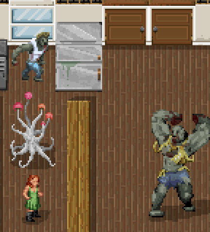

Ultimate Cataclysm (UltiCa) is a community made tileset for Cataclysm:dark days ahead.

Most of the development discussion and direction can be found on [Discord](https://discord.gg/kAXNZuy). This is a general summary.

## Installation:
- Download the latest release (for example UltiCaDemo_2019-10-30.zip) from the [releases](https://github.com/I-am-Erk/CDDA-Tilesets/releases) page
- Extract the zip folder after you downloaded it.
- Put the UltimateCataclysm folder in your cataclysmdda\gfx folder. It should look like cataclysmdda\gfx\UltimateCataclysm.

This repository stores individual sprites for UltiCa in PNG format, and also source files with layering in PSD (Photoshop) or XCF (gimp 2.10) format. These will then be compiled into a tileset using a python script maintained by mlangsdorf.

## Style Guides
- 32x32 tile base
- character and monster sprites 64x64 with 8px offset from the ground to give them a 3d look
- all art should be in a pseudo-16 bit format. While you can use the full range of modern colour palettes, each colour block of a sprite should be limited to 3-6 colours. For example a blue shirt might have one light blue highlight, two medium blue main colours, one dark blue shade, and one very dark blue-green shade.
- avoid outlines on terrain and character/monster sprites. Items and wielded items (not worn) should have a single pixel black lower edge outline.
- the default light source is assumed to come from above and to the left
- use PNG transparency to create a 50% opaque black drop shadow when possible, extending behind and to the right of the sprite.

### Item tiles
- Item tiles should be as close to scale as they can be while still recognizable. When in doubt, err on the side of larger, but avoid filling an entire 32x32 tile with a single nail or it would look like a nail as large as a survivor. For many items that are small in real life it might help if they're drawn on a 16x16 canvas first.
- Even for single items, putting multiple items into the icon could give it more recognizability without making it look comically huge.
- Items and wielded items (not worn) should have a single pixel black lower edge outline.
- Containers, like jars or bottles, should be drawn empty as the game will use the same tile no matter the actual content of the item.

### Folder/Filename Structure
- put files into the best appropriate folder (terrain, furniture, mutations, items, etc)
- give files a name based on the JSON ID they suit, eg t_floor
- if multiple files apply to that ID, make a subfolder eg terrain/t_floor/ for all the views
- for the moment, there isn't a clear naming convention after that. Working on it.

## Licensing
Cataclysm:Dark Days Ahead and the Ultimate Cataclysm tileset is the result of contributions from volunteers under the Creative Commons Attribution ShareAlike 3.0 license. The code and content of the game is free to use, modify, and redistribute for any purpose whatsoever. See [Creative Commons](http://creativecommons.org/licenses/by-sa/3.0/) for details. Some code distributed with the project is not part of the project and is released under different software licenses, the files covered by different software licenses have their own license notices.
