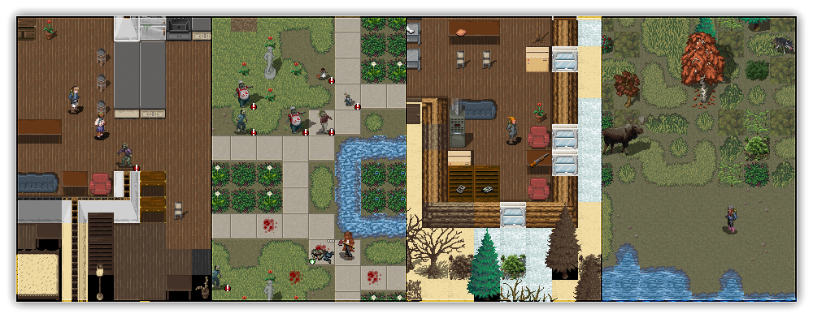

    

    
            
            

        
**Ultimate Cataclysm** (UltiCa) is a community made tileset for Cataclysm: Dark Days Ahead. It is inspired by old school pixel art games and tries to encapsulate a dark tone and atmosphere of utter desperation of the cataclysm.

This repository stores individual sprites for UltiCa in PNG format, and also source files with layering in *PSD* (Photoshop), *XCF* (gimp 2.10) or *KRA* (Krita) formats. PNGs will then be compiled into a tileset using a python script maintained by mlangsdorf (The script is located in the main Cataclysm repo under `tools/gfx_tools/compose.py`).

## Installation:
- Download the [latest release](https://github.com/I-am-Erk/CDDA-Tilesets/releases/latest) from the releases page (Not the source code !).
- Extract the zip folder after you downloaded it.
- Put the *UltimateCataclysm* folder in your `cataclysmdda\gfx` folder. 

  It should look like: `cataclysmdda\gfx\UltimateCataclysm`.

> ⚠️: If you have "Missing "tile_config.json" file" error upon loading tileset, this means that you downloaded and extracted the source code, and **not** the tileset. Consult [#82](../../issues/82).

## Style Guides

We don't have very strict rules about how and what you should be drawing, but we do have some guides that helps maintain consistency across sprites. These are divided between groups: *general*, *items* (things on the floor), *overlay* (wielded/worn/mutations), *monsters* and *terrain*.

### General
- Try to draw with real life proportions;
- Use a limited set of colors as in pseudo-16 bit format. This means that each "colour block" should use 3-6 colors for shades. For example a blue shirt might have one light blue highlight, two medium blue main colours, one dark blue shade, and one very dark blue-green shade.
- The default light source is assumed to come from above and to the left.
- Avoid full black outlines.

### Items
- 32x32 tile base; small items should fit within 16x16.
- Item tiles should be as close to scale as they can be while still recognizable. When in doubt, err on the side of larger, but avoid filling an entire 32x32 tile with a single nail or it would look like a nail as large as a survivor.
- Even for single items, putting multiple items into the icon could give it more recognizability without making it look comically huge.
- Containers, like jars or bottles, should be drawn empty as the game will use the same tile no matter the actual content of the item.
- 100% black underline; this helps to identify an item in the game world.

### Overlay
- 32x64 tile base; see [base male sprite](./gfx/UltimateCataclysm/pngs_tall_32x64/overlay/skin/skin_light/skin_light_m.png) and [base female sprite](./gfx/UltimateCataclysm/pngs_tall_32x64/overlay/skin/skin_light/skin_light_f.png) for reference.

### Monsters
- Take appropriate tile size; consider 32x64 a default human size.
- Monster sprites should have ~8px offset from the ground to give them a 3d look.
- Monsters should drop shadows when possible: 50% opaque black, extending behind and to the right of the sprite.

### Terrain
- Walls and floors are 32x32, other things you should size accordingly to it's size in the world.

## Folder/Filename Structure
- Put files into the best appropriate folder (terrain, furniture, mutations, items, etc).
- Give files a name based on the JSON ID they suit, eg `t_floor`.
- If multiple files apply to that ID, make a subfolder eg `terrain/t_floor/` for all the views.
- For the moment, there isn't a clear naming convention after that. Working on it.

## Licensing
Cataclysm:Dark Days Ahead and the Ultimate Cataclysm tileset is the result of contributions from volunteers under the Creative Commons Attribution ShareAlike 3.0 license. The code and content of the game is free to use, modify, and redistribute for any purpose whatsoever. See [Creative Commons](http://creativecommons.org/licenses/by-sa/3.0/) for details. Some code distributed with the project is not part of the project and is released under different software licenses, the files covered by different software licenses have their own license notices.
